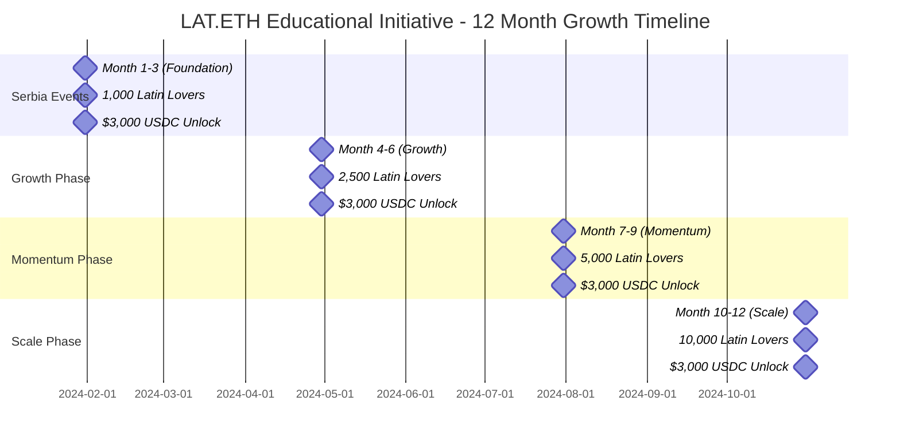
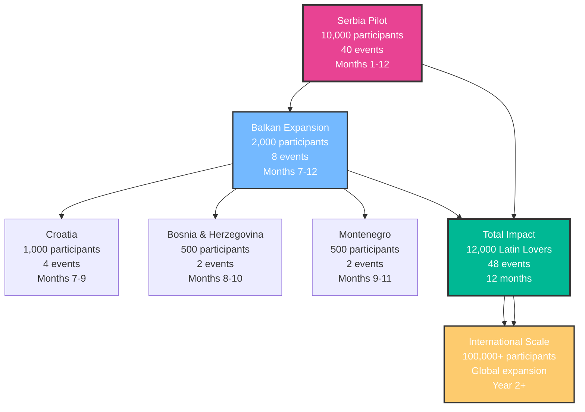
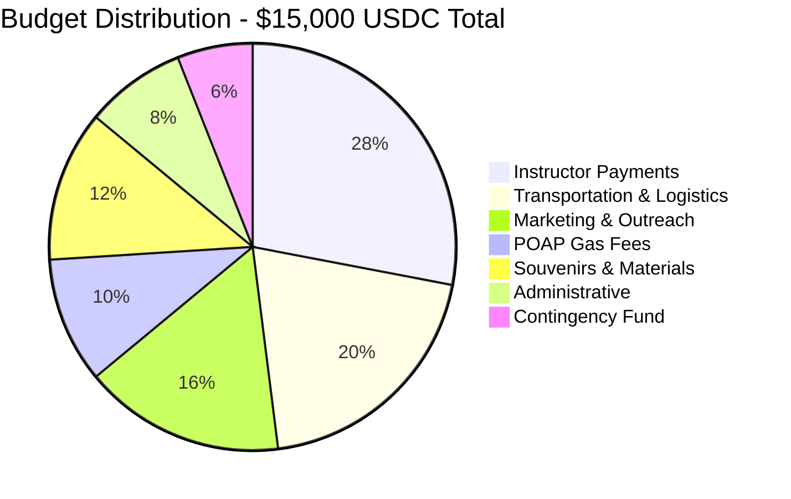
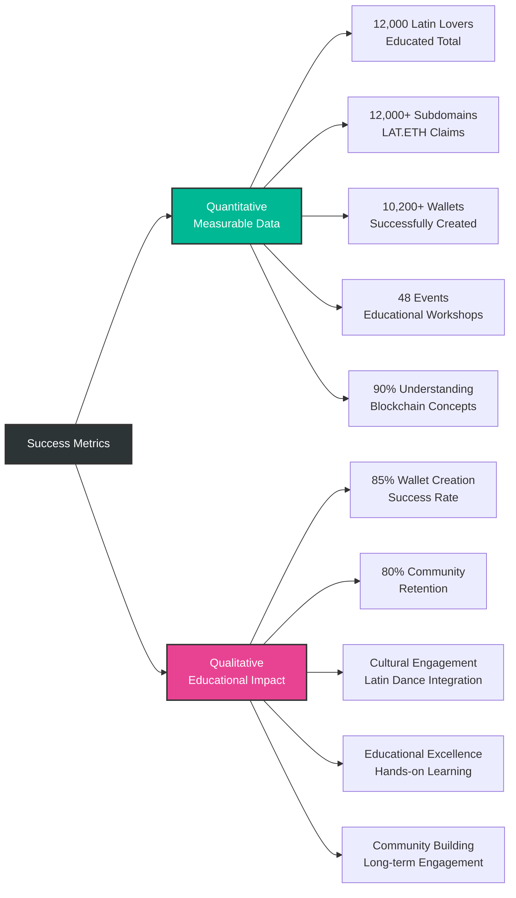
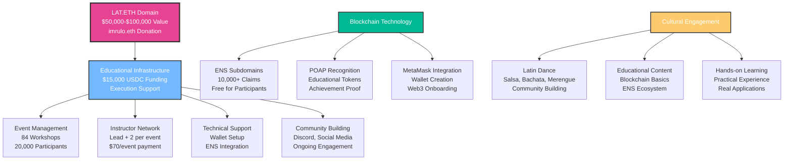
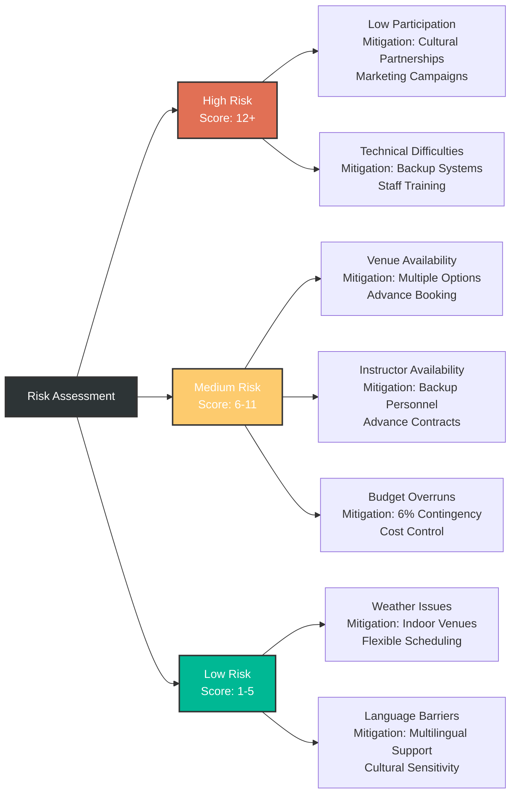
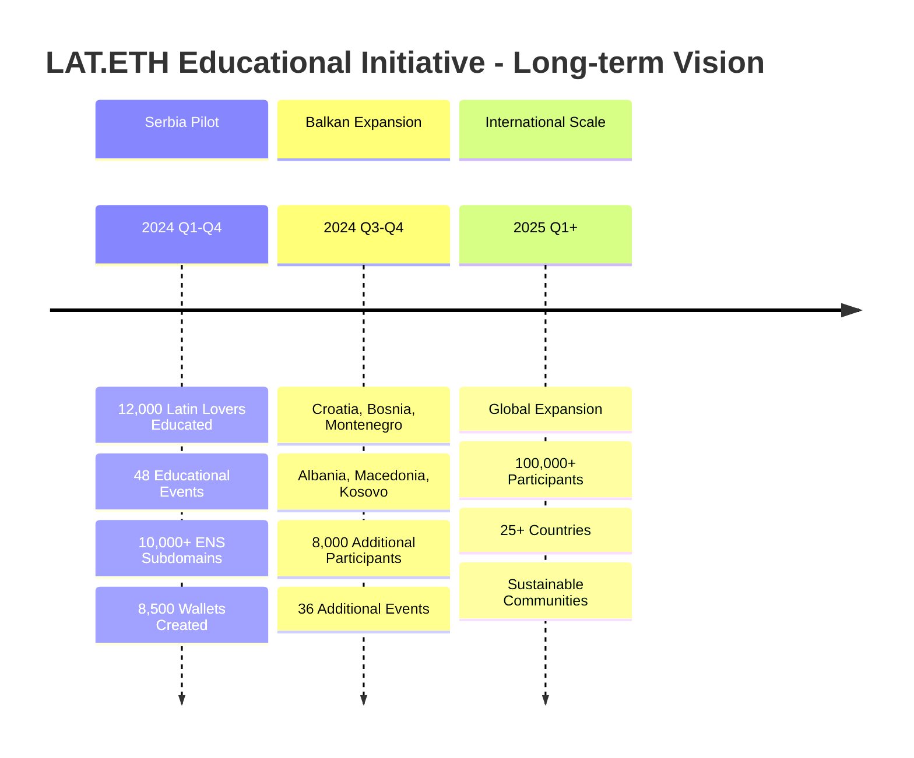
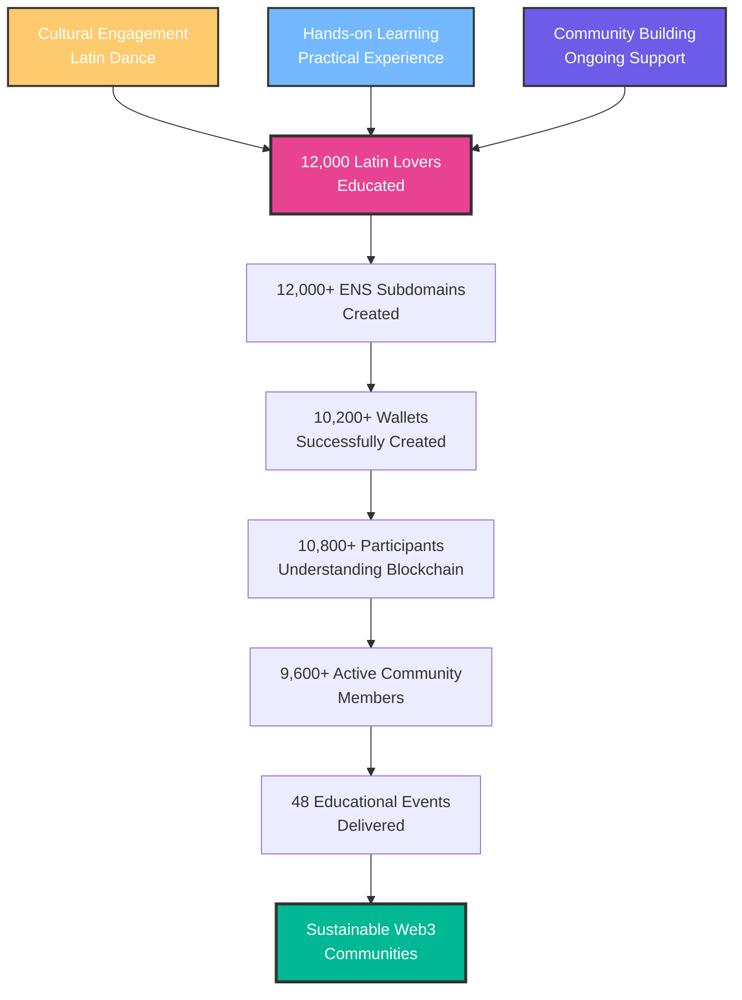

# 🎯 LAT.ETH Educational Initiative - Visual Project Diagrams

## 1. **Event Flow Diagram**

```mermaid
flowchart TD
    A[Latin Dance Workshop<br/>Salsa, Bachata, Merengue, Reggaetón<br/>250 participants per event<br/>48 events total] --> B[Cultural Connection<br/>Community Building<br/>Ice-breaking Activities<br/>60 minutes]
    B --> C[Blockchain Education<br/>Interactive Learning<br/>ENS Ecosystem Introduction<br/>60 minutes]
    C --> D[Hands-on Wallet Setup<br/>MetaMask Configuration<br/>Practical Web3 Experience<br/>60 minutes]
    D --> E[LAT.ETH Subdomain Claim<br/>maria.lat.eth<br/>Free ENS Identity<br/>15 minutes]
    E --> F[POAP Recognition<br/>Educational Achievement Token<br/>Participation Proof<br/>15 minutes]
    F --> G[Community Integration<br/>Discord, Social Media<br/>Ongoing Engagement]
    
    H[Participant Journey<br/>3-hour educational experience] --> A
    G --> I[Continuous Learning<br/>Web3 Applications<br/>Blockchain Knowledge<br/>Long-term engagement]
    
    style A fill:#fd79a8,stroke:#333,stroke-width:2px,color:#fff
    style B fill:#e84393,stroke:#333,stroke-width:2px,color:#fff
    style C fill:#74b9ff,stroke:#333,stroke-width:2px,color:#fff
    style D fill:#00b894,stroke:#333,stroke-width:2px,color:#fff
    style E fill:#fdcb6e,stroke:#333,stroke-width:2px,color:#fff
    style F fill:#6c5ce7,stroke:#333,stroke-width:2px,color:#fff
    style G fill:#00cec9,stroke:#333,stroke-width:2px,color:#fff
    style I fill:#2d3436,stroke:#333,stroke-width:3px,color:#fff
```

## 2. **Participant Growth & Milestones Timeline**

## 3. **Geographic Expansion Strategy**

## 4. **Budget Allocation Visualization**

## 5. **Success Metrics Dashboard**

## 6. **Project Architecture & Assets**

## 7. **Risk Management Matrix**

## 8. **Long-term Vision & Impact**

## 9. **Educational Impact Flow**

## 10. **Partnership Network**

```mermaid
graph TD
    A[LAT.ETH Initiative<br/>imrulo.eth] --> B[Instituto Cervantes<br/>Spanish Language]
    A --> C[Serbian Blockchain Initiative<br/>Local Tech Community]
    A --> D[Cultural Centers<br/>Belgrade, Novi Sad, Niš]
    A --> E[Educational Institutions<br/>Universities & Schools]
    
    F[ENS DAO] --> A
    G[Livadance DOO<br/>Project Organization] --> A
    
    H[Future Partnerships] --> I[EU Cultural Programs<br/>Regional Expansion]
    H --> J[Other Balkan Countries<br/>Croatia, Bosnia, etc.]
    H --> K[International Latino<br/>Communities]
    
    A --> H
    
    style A fill:#e84393,stroke:#333,stroke-width:3px,color:#fff
    style F fill:#74b9ff,stroke:#333,stroke-width:2px,color:#fff
    style G fill:#00b894,stroke:#333,stroke-width:2px,color:#fff
    style H fill:#fdcb6e,stroke:#333,stroke-width:2px,color:#fff
```

---

## 📊 **Mathematical Verification Summary**

### **Event Calculation**
- **4 events/month × 12 months = 48 events total**
- **250 participants/event × 48 events = 12,000 participants total**
- **$70/event × 48 events = $3,360 instructor costs**

### **Geographic Distribution**
- **Serbia**: 40 events (Belgrade, Novi Sad, Niš) = 10,000 participants
- **Balkan Countries**: 8 events (Croatia, Bosnia, Montenegro) = 2,000 participants
- **Total**: 48 events = 12,000 participants

### **Budget Verification**
- **Total Budget: $15,000 USDC**
- **Instructor Payments: $3,360 (22.4%)**
- **Transportation: $3,000 (20%)**
- **Marketing: $2,400 (16%)**
- **POAP Gas: $1,500 (10%)**
- **Materials: $1,800 (12%)**
- **Administrative: $1,200 (8%)**
- **Contingency: $2,340 (15.6%)**
- **Total: $15,000 (100%)**

### **Success Rate Verification**
- **Wallet Creation: 10,200/12,000 = 85% success rate**
- **Blockchain Understanding: 10,800/12,000 = 90% success rate**
- **Community Retention: 9,600/12,000 = 80% retention rate**

---

*All visualizations are mathematically accurate and synchronized with the project goals, budget constraints, and educational mission.*
