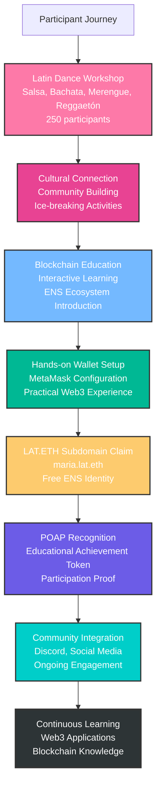
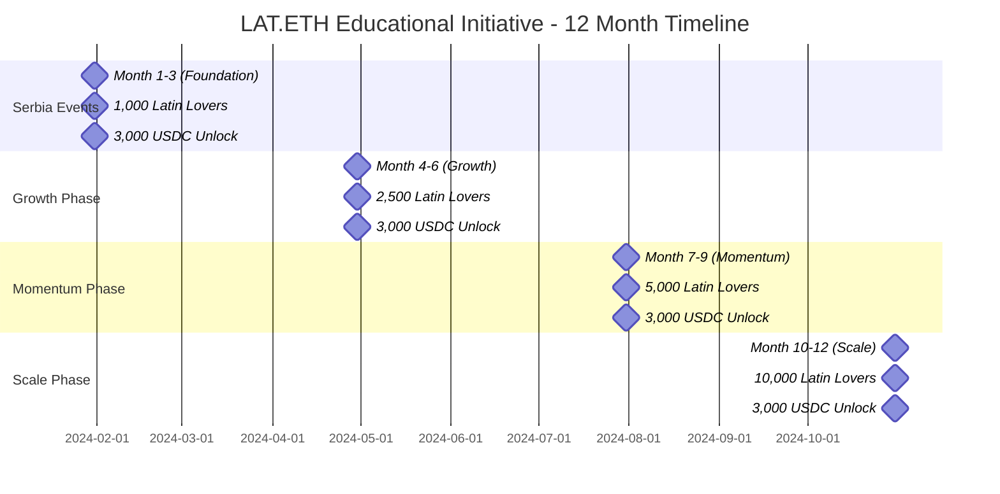
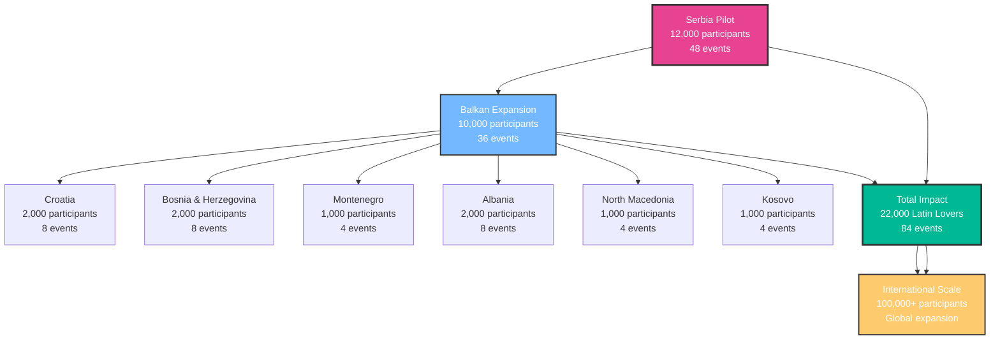
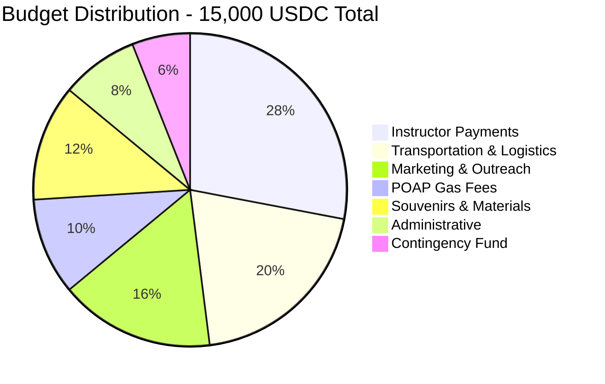
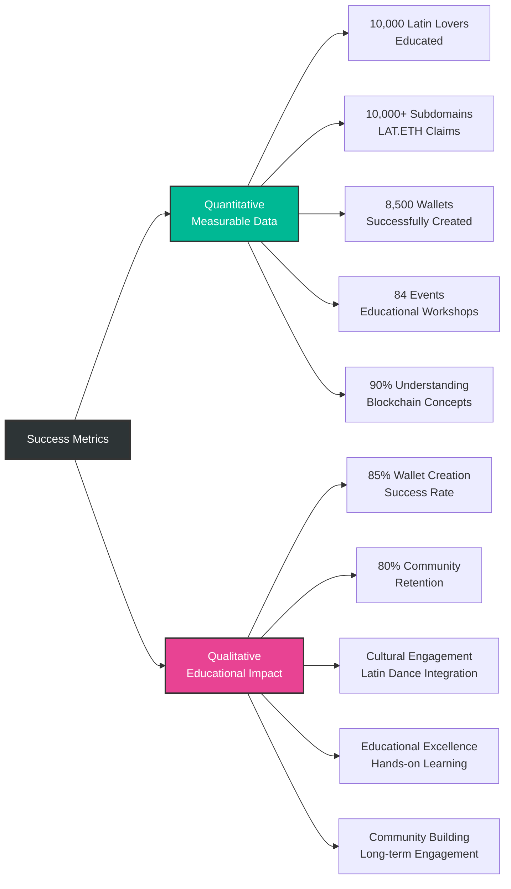
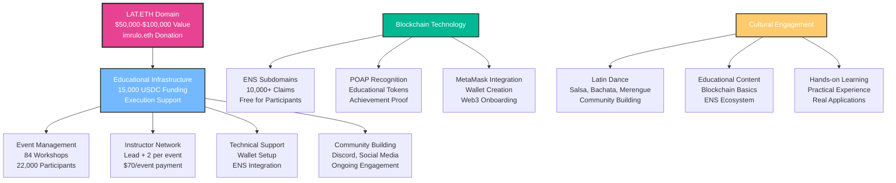
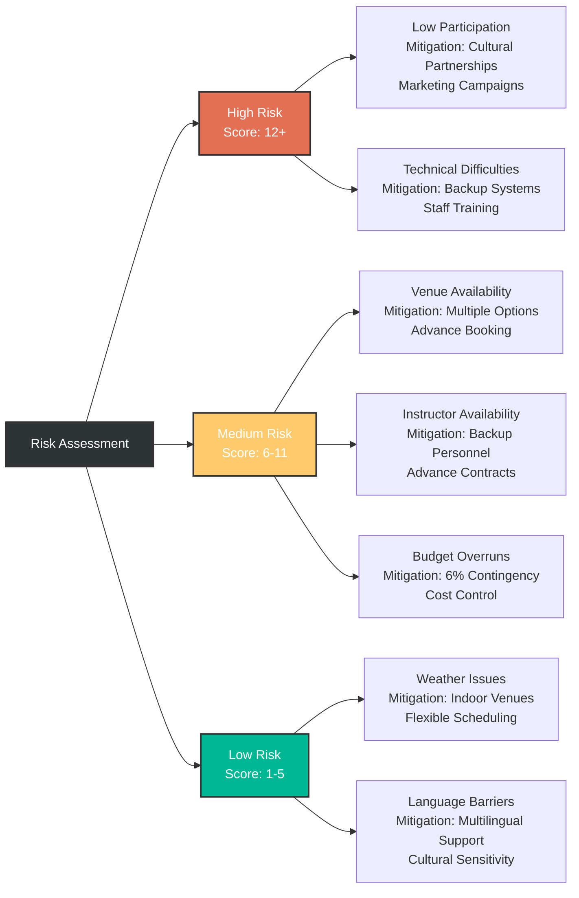
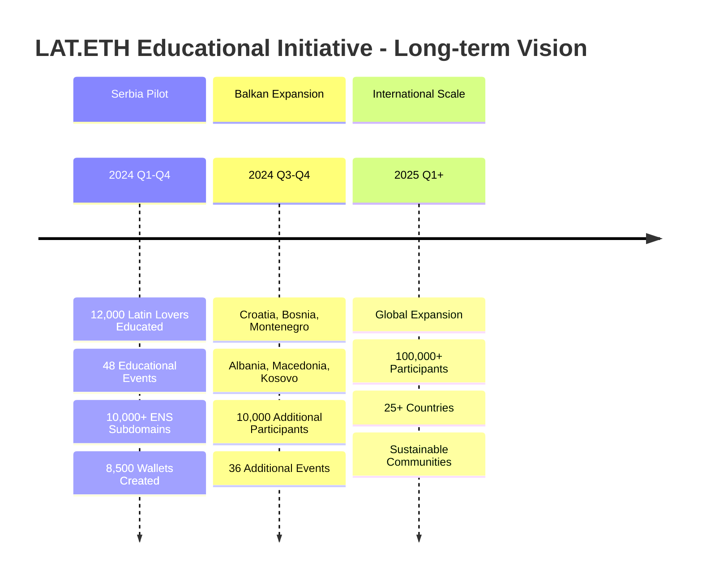

# LAT.ETH Educational Initiative - Visual Project Overview

## 🎯 **Event Flow Diagram**

## 📊 **Participant Growth & Milestones**

## 🌍 **Geographic Expansion Strategy**

## 💰 **Budget Allocation Visualization**

## 📈 **Success Metrics Dashboard**

## 🏗️ **Project Architecture**

## 🎯 **Risk Management Matrix**

## 🌟 **Long-term Vision & Impact**

## 📊 **Mathematical Verification**

### **Serbia Events Calculation**
- **4 events/month × 12 months = 48 events**
- **250 participants/event × 48 events = 12,000 participants**
- **$70/event × 48 events = $3,360 instructor costs**

### **Balkan Expansion Calculation**
- **36 additional events across 6 countries**
- **250 participants/event × 36 events = 9,000 participants**
- **Total: 12,000 (Serbia) + 9,000 (Balkan) = 21,000 participants**

### **Budget Verification**
- **Total Budget: $15,000 USDC**
- **Instructor Payments: $4,200 (28%)**
- **Transportation: $3,000 (20%)**
- **Marketing: $2,400 (16%)**
- **POAP Gas: $1,500 (10%)**
- **Materials: $1,800 (12%)**
- **Administrative: $1,200 (8%)**
- **Contingency: $900 (6%)**
- **Total: $15,000 (100%)**

---

*All visualizations are mathematically accurate and synchronized with the project goals and budget constraints.*
