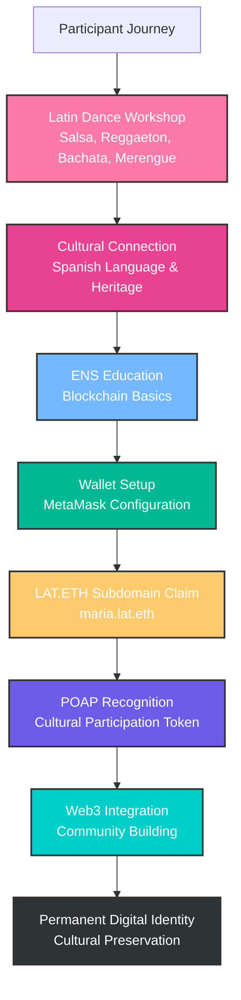
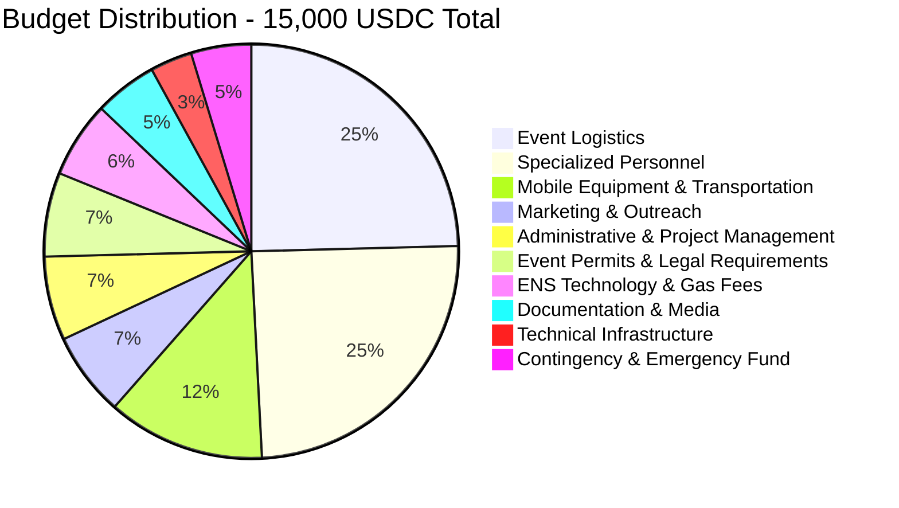
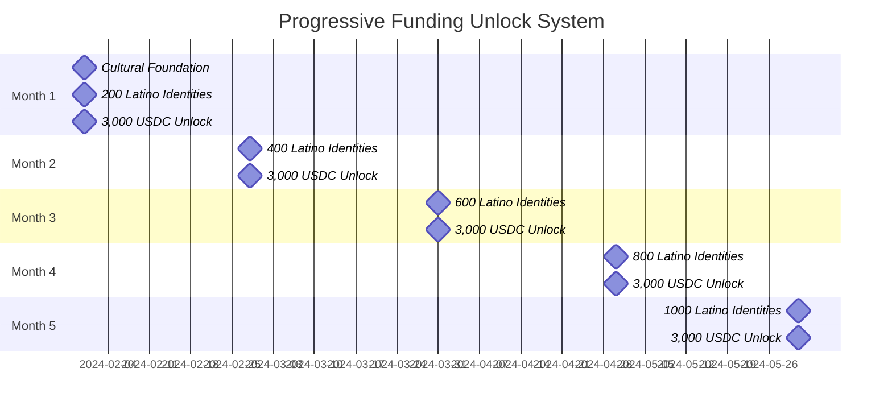
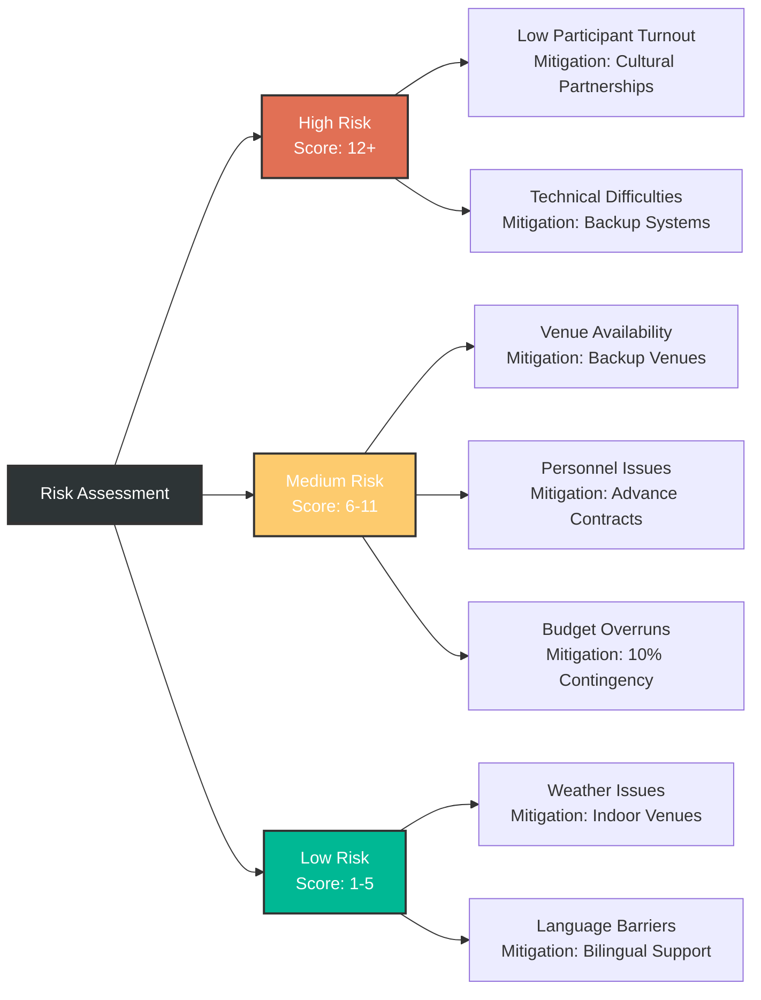
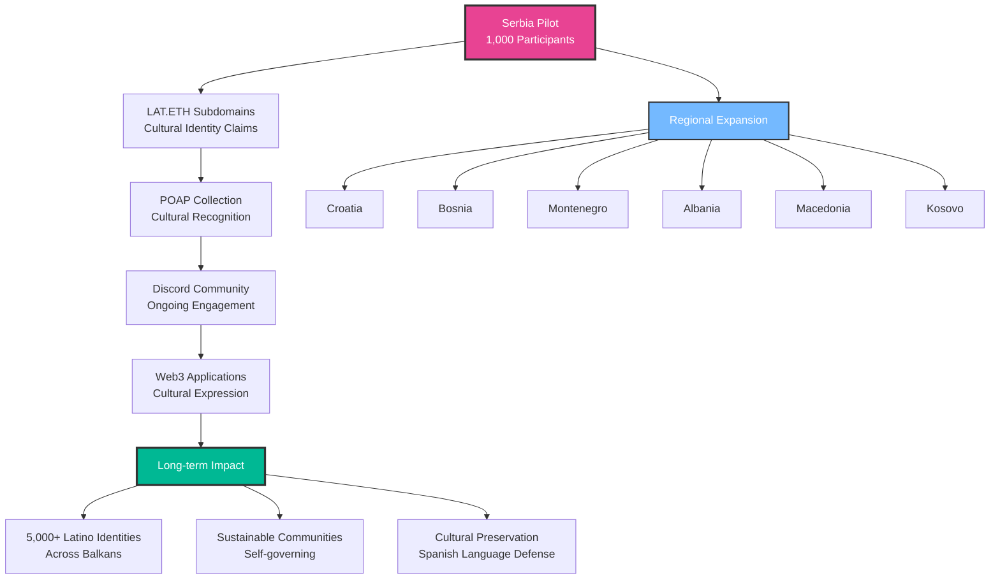
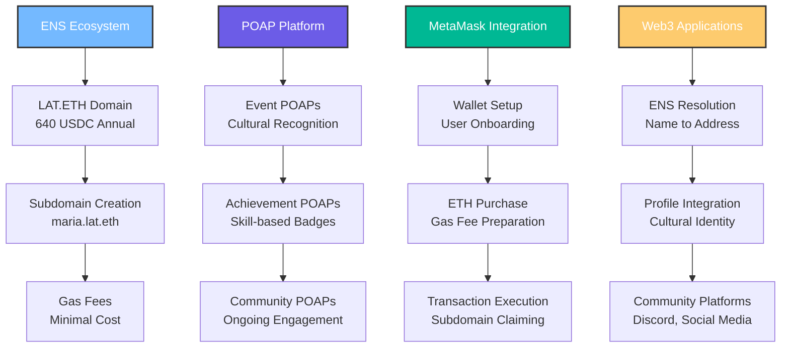
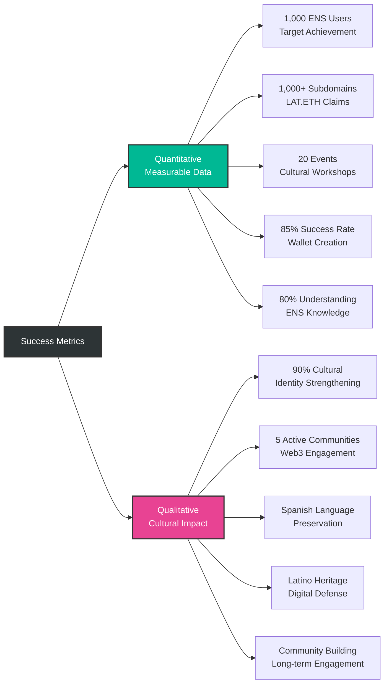
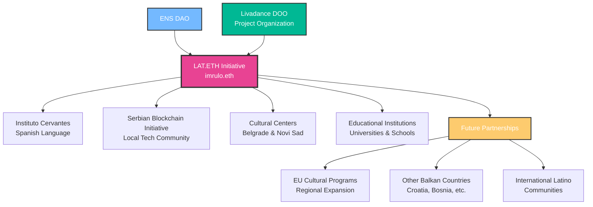
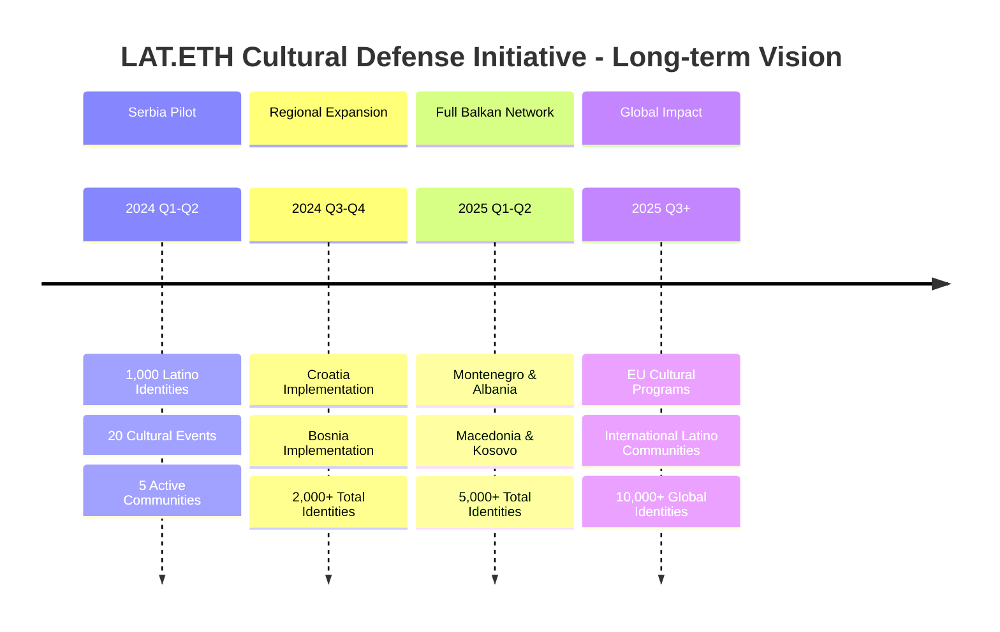

# Project Flow Diagram - LAT.ETH Cultural Defense Initiative

## Overview
This document contains professional Mermaid diagrams that visualize the complete LAT.ETH Cultural Defense Initiative project structure, flow, and impact.

## 1. Project Structure Overview

```mermaid
graph TD
    A[LAT.ETH Cultural Defense Initiative] --> B[GOAL Level<br/>Cultural Preservation<br/>4,500 USDC - 30%]
    A --> C[PURPOSE Level<br/>Digital Network<br/>4,500 USDC - 30%]
    A --> D[COMPONENTS Level<br/>Infrastructure<br/>6,000 USDC - 40%]
    
    B --> B1[1,000 Latino Identities<br/>Preserved]
    B --> B2[90% Cultural<br/>Strengthening]
    B --> B3[5 Active Communities<br/>in Web3]
    
    C --> C1[3 Dance Instructors<br/>+ imrulo.eth]
    C --> C2[85% Wallet Creation<br/>Success Rate]
    C --> C3[80% ENS Understanding<br/>Achievement]
    
    D --> D1[20 Cultural Events<br/>4,500 USDC]
    D --> D2[Mobile Equipment<br/>2,250 USDC]
    D --> D3[ENS Technology<br/>1,090 USDC]
    D --> D4[Marketing & Outreach<br/>1,200 USDC]
    D --> D5[Administrative<br/>1,200 USDC]
    D --> D6[Legal & Permits<br/>1,200 USDC]
    D --> D7[Documentation<br/>900 USDC]
    D --> D8[Technical Infrastructure<br/>600 USDC]
    D --> D9[Contingency<br/>860 USDC]
    
    style A fill:#e84393,stroke:#333,stroke-width:3px,color:#fff
    style B fill:#00b894,stroke:#333,stroke-width:2px,color:#fff
    style C fill:#74b9ff,stroke:#333,stroke-width:2px,color:#fff
    style D fill:#fdcb6e,stroke:#333,stroke-width:2px,color:#fff
```

## 2. Cultural Onboarding Flow

## 3. Budget Allocation Visualization

## 4. Progressive Funding Timeline

## 5. Risk Management Matrix

## 6. Community Impact Flow

## 7. Technical Architecture

## 8. Success Metrics Dashboard

## 9. Partnership Network

## 10. Long-term Vision

---

## Usage Instructions

These diagrams can be:
1. **Integrated into proposals** for visual impact
2. **Used in presentations** for clear communication
3. **Referenced in documentation** for better understanding
4. **Shared with stakeholders** for project visualization

All diagrams are professionally designed with consistent color schemes and clear information hierarchy, suitable for international grant evaluation and professional presentation.
