# Diagramas del Proyecto - Iniciativa Educativa LAT.ETH
## Diagramas Mermaid para Flujo de Eventos, Viaje del Participante, Asignación de Presupuesto y Hitos

**Tipo de Documento:** Documentación Visual del Proyecto  
**Proyecto:** Iniciativa Educativa LAT.ETH  
**Marco:** Modelo Educativo con Compromiso Cultural  

---

## 1. Diagrama de Flujo de Eventos

Este diagrama muestra la estructura del taller educativo de 3 horas:

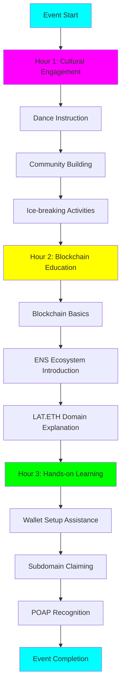

---

## 2. Diagrama del Viaje del Participante

Este diagrama muestra el viaje completo del participante desde la conciencia hasta el compromiso continuo:

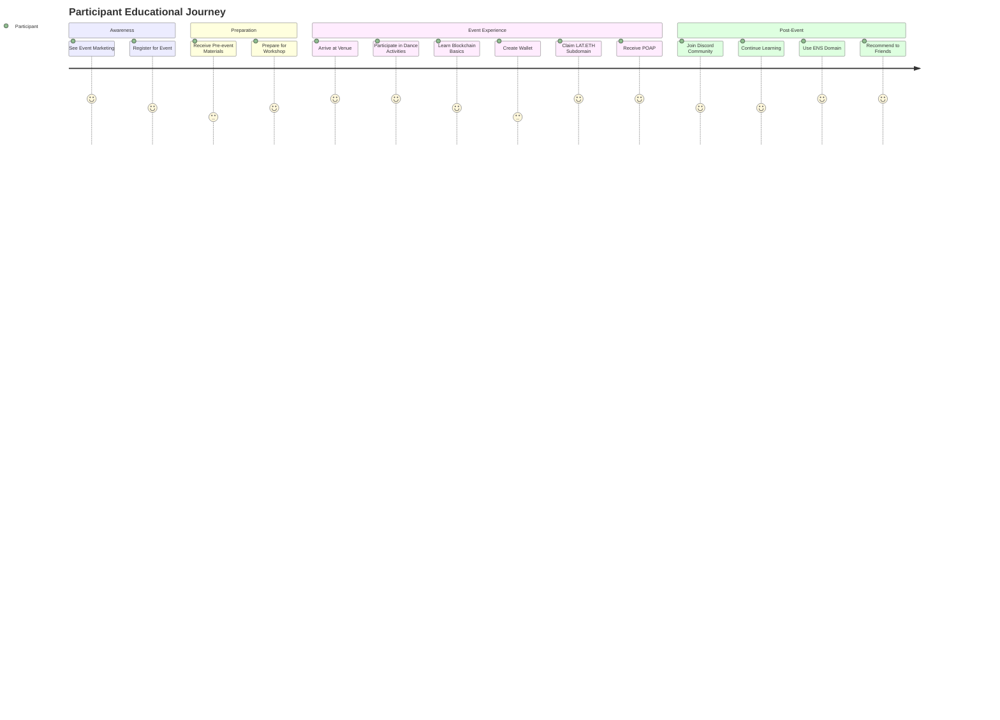

---

## 3. Diagrama de Asignación de Presupuesto

Este diagrama muestra la distribución del presupuesto a través de los niveles del Marco Lógico:

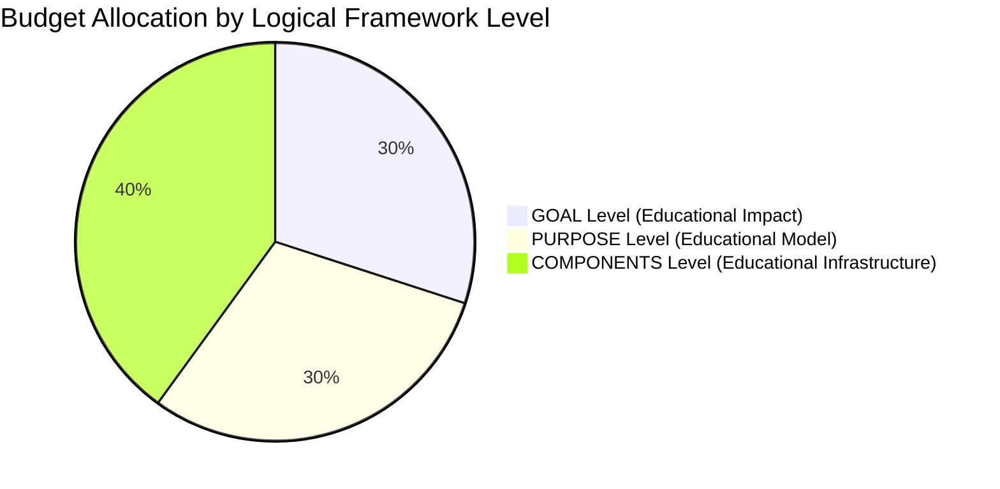

---

## 4. Desglose Detallado del Presupuesto

Este diagrama muestra la asignación detallada del presupuesto a través de todas las categorías:

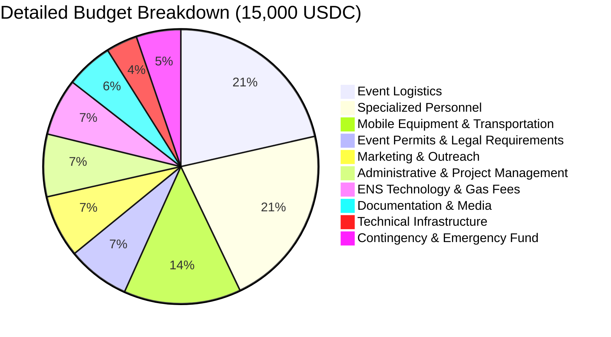

---

## 5. Hitos de Financiación Progresiva

Este diagrama muestra el sistema de desbloqueo de financiación progresiva:

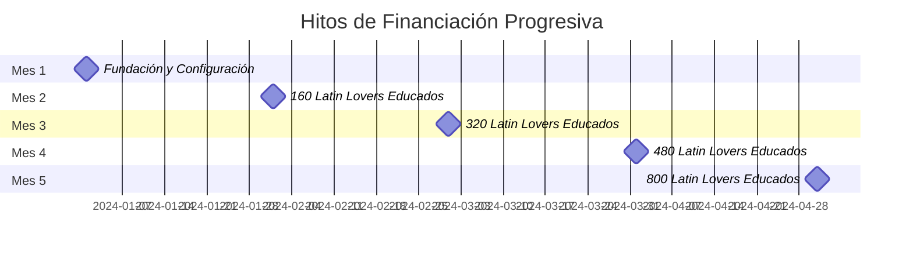

---

## 6. Estrategia de Expansión Balcánica

Este diagrama muestra el cronograma de expansión a través de los países balcánicos:

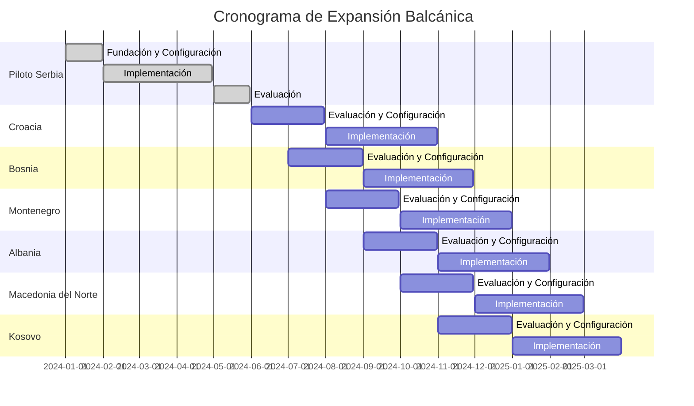

---

## 7. Flujo de Impacto Educativo

Este diagrama muestra cómo las actividades educativas llevan a resultados medibles:

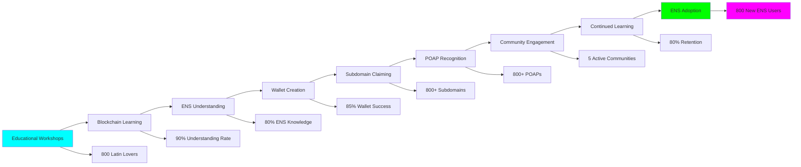

---

## 8. Risk Management Matrix

This diagram shows the risk assessment and mitigation strategies:

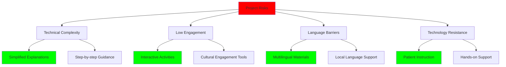

---

## 9. Team Structure and Responsibilities

This diagram shows the organizational structure and responsibilities:

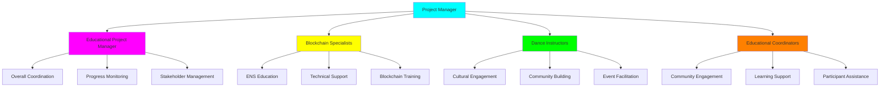

---

## 10. Dashboard de Métricas de Éxito

Este diagrama muestra los indicadores clave de rendimiento y sus relaciones:

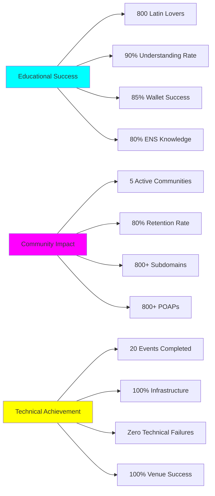

---

## 11. Visión a Largo Plazo y Escalamiento

Este diagrama muestra la progresión del piloto a escala internacional:

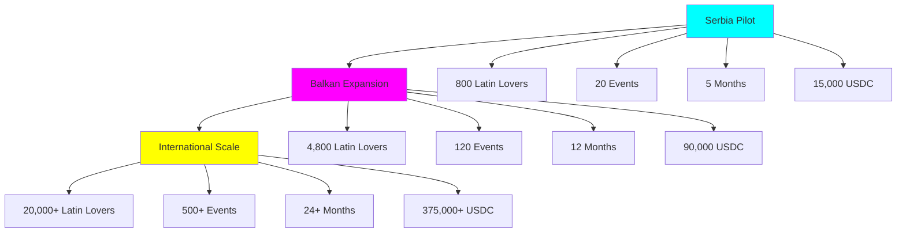

---

## 12. Alineación con ENS DAO

Este diagrama muestra cómo el proyecto se alinea con los objetivos del ENS DAO:

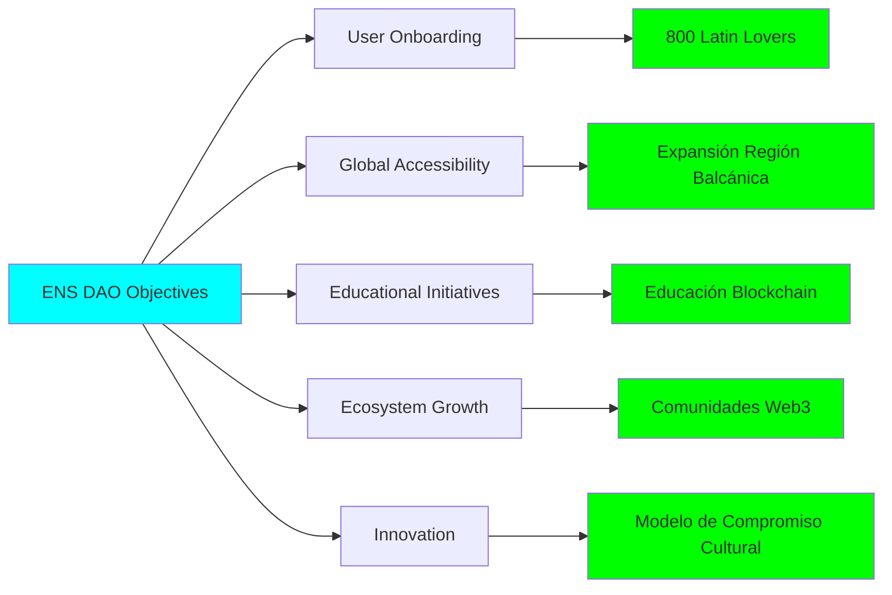

---

## Conclusión

Estos diagramas Mermaid proporcionan una representación visual integral de la Iniciativa Educativa LAT.ETH, mostrando:

1. **Flujo de Eventos**: Estructura clara de talleres de 3 horas
2. **Viaje del Participante**: Experiencia educativa completa
3. **Asignación de Presupuesto**: Distribución transparente de fondos
4. **Hitos Progresivos**: Sistema de financiación basado en hitos
5. **Estrategia de Expansión**: Escalamiento balcánico e internacional
6. **Impacto Educativo**: Resultados de aprendizaje medibles
7. **Gestión de Riesgos**: Estrategias de mitigación integrales
8. **Estructura del Equipo**: Responsabilidades organizacionales claras
9. **Métricas de Éxito**: Indicadores clave de rendimiento
10. **Visión a Largo Plazo**: Escalamiento del piloto a internacional
11. **Alineación ENS DAO**: Alineación clara de objetivos

Estas representaciones visuales hacen el proyecto más accesible y demuestran el enfoque profesional y estructurado para la educación blockchain a través del compromiso cultural.
