# Project Diagrams - LAT.ETH Educational Initiative
## Mermaid Diagrams for Event Flow, Participant Journey, Budget Allocation, and Milestones

**Document Type:** Visual Project Documentation  
**Project:** LAT.ETH Educational Initiative  
**Framework:** Educational Model with Cultural Engagement  

---

## 1. Event Flow Diagram

This diagram shows the 3-hour educational workshop structure:

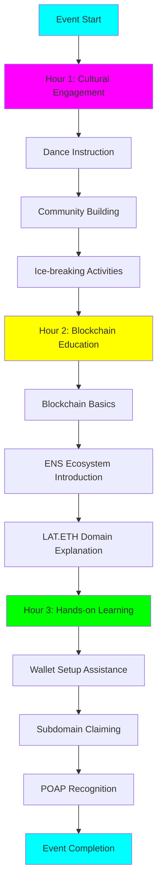

---

## 2. Participant Journey Diagram

This diagram shows the complete participant journey from awareness to continued engagement:

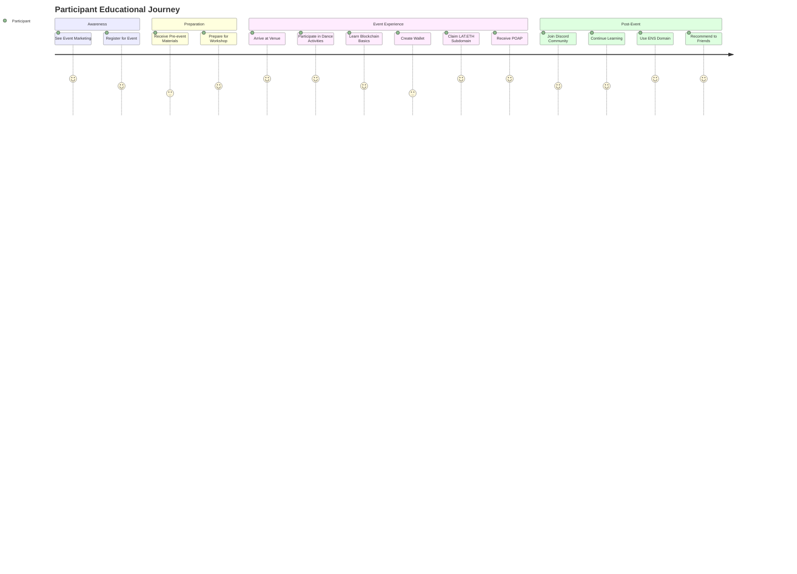

---

## 3. Budget Allocation Diagram

This diagram shows the budget distribution across the Logical Framework levels:

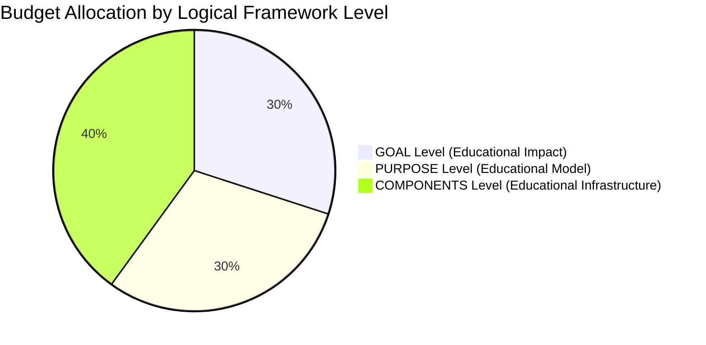

---

## 4. Detailed Budget Breakdown

This diagram shows the detailed budget allocation across all categories:

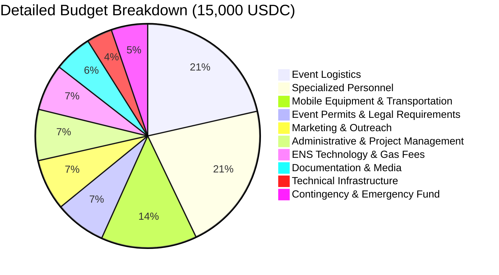

---

## 5. Progressive Funding Milestones

This diagram shows the progressive funding unlock system:

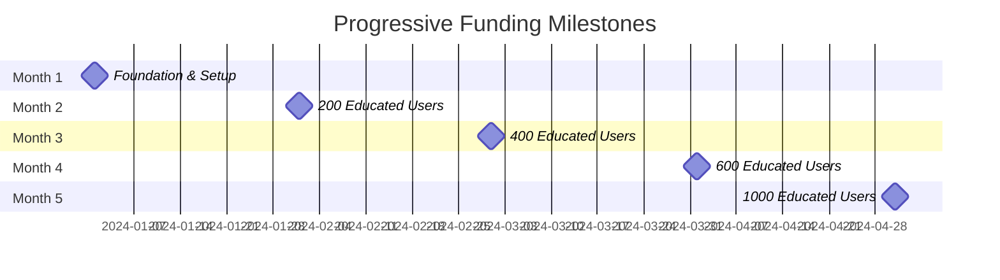

---

## 6. Balkan Expansion Strategy

This diagram shows the expansion timeline across Balkan countries:

---

## 7. Educational Impact Flow

This diagram shows how educational activities lead to measurable outcomes:

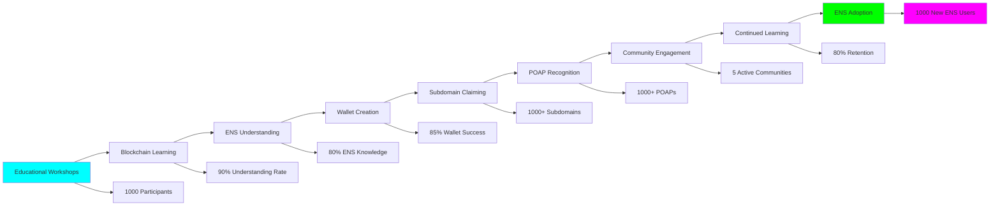

---

## 8. Risk Management Matrix

This diagram shows the risk assessment and mitigation strategies:

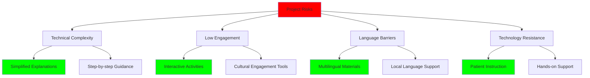

---

## 9. Team Structure and Responsibilities

This diagram shows the organizational structure and responsibilities:

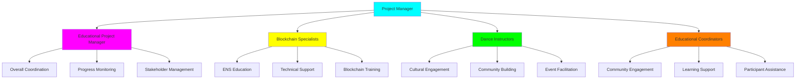

---

## 10. Success Metrics Dashboard

This diagram shows the key performance indicators and their relationships:

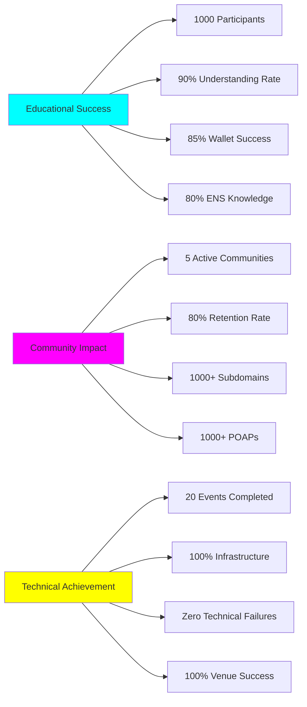

---

## 11. Long-term Vision and Scaling

This diagram shows the progression from pilot to international scale:

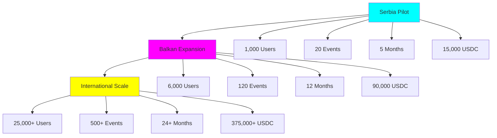

---

## 12. ENS DAO Alignment

This diagram shows how the project aligns with ENS DAO objectives:

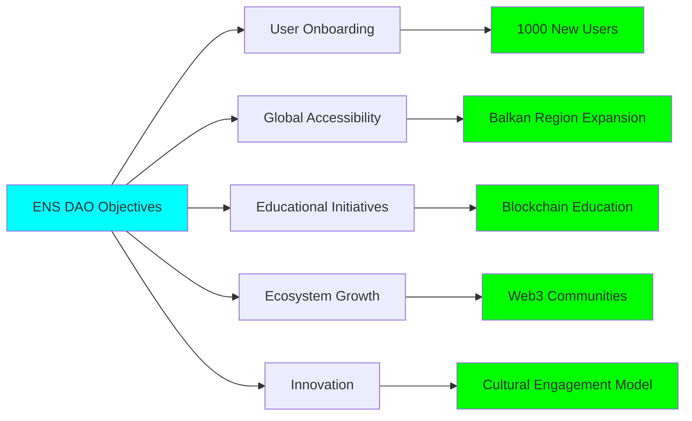

---

## Conclusion

These Mermaid diagrams provide a comprehensive visual representation of the LAT.ETH Educational Initiative, showing:

1. **Event Flow**: Clear 3-hour workshop structure
2. **Participant Journey**: Complete educational experience
3. **Budget Allocation**: Transparent fund distribution
4. **Progressive Milestones**: Milestone-based funding system
5. **Expansion Strategy**: Balkan and international scaling
6. **Educational Impact**: Measurable learning outcomes
7. **Risk Management**: Comprehensive mitigation strategies
8. **Team Structure**: Clear organizational responsibilities
9. **Success Metrics**: Key performance indicators
10. **Long-term Vision**: Scaling from pilot to international
11. **ENS DAO Alignment**: Clear objective alignment

These visual representations make the project more accessible and demonstrate the professional, structured approach to blockchain education through cultural engagement.
